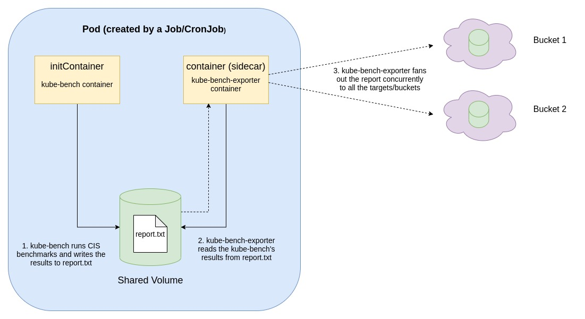

# kube-bench-exporter

Helps you to export your cluster's [kube-bench](https://github.com/aquasecurity/kube-bench) reports to remote targets like multiple Amazon S3 buckets, Azure blob storage, etc. in one-go with ease.

> Disclaimer: As of now, it can  only export the kube-bench reports to S3 buckets. Functionality around exporting to Azure Blob Store is Work-in-progress.

## But why do we need this?

[Kube-bench](https://github.com/aquasecurity/kube-bench) runs CIS Benchmark Tests over your kubernetes cluster and exports the results to stdout but it doesn't have a native support to exporting those same results to a remote storage like an Amazon S3 bucket.

Hence, with this kube-bench-exporter you can do that and that too to multiple S3 buckets (or Azure Blob storage) concurrently in one-go.

## How does kube-bench-exporter work?
kube-bench-exporter works on the idea of sidecar pattern (kinda) where the sidecar container is the kube-bench-exporter container which is delegated to export your [kube-bench](https://github.com/aquasecurity/kube-bench) reports.

The main kube-bench container remains untouched and up-to-date with [kube-bench upstream](https://github.com/aquasecurity/kube-bench) and it simply runs the way it usually runs and exports the reports to a local .txt file via piping through stdout, and exits.

The only difference here is that, behind the scenes, the exported report will be mounted on a shared volume and this report will be read by our kube-bench-exporter sidecar container which it will upload to all the user-specified targets like S3 buckets.

And that too, it performs all the uploads to all the targets concurrently in one-go in a manner of Asynchronous fan-out instead of uploading to each target one-by-one. This is done to ensures two things:
- Avoiding convoy effect: If a certain upload is taking time to get processed, other uploads don't end up waiting for it to complete. (The go-scheduler context switches from the upload which is stuck to other upload tasks so as to ensure minimal amount of waiting time).
- Avoiding Single-point-of-failure: If a certain upload fails due to an error, then still other uploads asynchronously happen without being affected.

<p align="center" style="margin:20px 20px 20px 20px;"></p>


## How to use it?
Say, you want to export your kube-bench reports to 2 of your S3 buckets.
- First of all, create a secret containing credentials to an IAM user having enough access to upload files to those 2 S3 buckets.
```yaml
apiVersion: v1
kind: Secret
metadata:
  name: aws-creds ### DO NOT TOUCH THIS
  namespace: kube-system ### DO NOT TOUCH THIS
stringData:
  AWS_ACCESS_KEY: <access key of your IAM user>
  AWS_SECRET_ACCESS_KEY: <secret access key of your IAM user>
```
- Now, create a configmap containing the details of the S3 buckets in which you want your kube-bench reports to exported. kube-bench-exporter will export (fan-out) to all the below targets concurrently.
Say, there are two targets:
    - A bucket named "bucket1" in the region "us-east-1" and you want the reports to be uploaded under the folder "sample-folder/kube-bench-reports".
    - A bucket named "bucket2" in the region "ap-southeast-1" and you want the reports to be uploaded at root directory in that bucket.
```yaml
apiVersion: v1
kind: ConfigMap
metadata:
  name: target-config  ### DO NOT TOUCH THIS
  namespace: kube-system ### DO NOT TOUCH THIS
data:
  target-config.yaml: | ### DO NOT TOUCH THIS
    ##### EDIT FROM HERE ON
    [
      {
        "type": "s3",
        "config": {
          "bucket": "bucket1",
          "region": "us-east-1",
          "prefix": "sample-folder/kube-bench-reports"
        }
      },
      {
        "type": "s3",
        "config": {
          "bucket": "bucket2",
          "region": "ap-southeast-1"
        }
      }
    ]
```
- Finally, use the following manifest for all the hardwork of running, generating and exporting your kube-bench reports periodically. You don't have to mess around with the below manifest. DO NOT TOUCH ANYTHING IN THE BELOW MANIFEST. Just update the field which are commented in the manifest with "UPDATE:"
```yaml
apiVersion: batch/v1
kind: Job
metadata:
  name: kube-bench-exporter
  namespace: kube-system
spec:
    template:
      spec:
        hostPID: true
        initContainers:
        - name: kube-bench
          image: aquasec/kube-bench:latest
          command: ["/bin/sh"]
          args: ["-c", "kube-bench -v 3 --logtostderr --benchmark eks-1.0 > /export/kube-bench/report.txt"] ## UPDATE: Tweak this according to the kind of k8s cluster you have. For reference: checkout https://github.com/aquasecurity/kube-bench#running-in-a-kubernetes-cluster
          volumeMounts:
          - name: var-lib-kubelet
            mountPath: /var/lib/kubelet
            readOnly: true
          - name: etc-systemd
            mountPath: /etc/systemd
            readOnly: true
          - name: etc-kubernetes
            mountPath: /etc/kubernetes
            readOnly: true
          - name: published-report
            mountPath: /export/kube-bench/
        containers:
        - name: kube-bench-exporter-sidecar
          image:  yashvardhankukreja/kube-bench-exporter:v0.0.1
          imagePullPolicy: Never
          envFrom: 
          - secretRef:
              name: aws-creds
          volumeMounts:
          - name: published-report
            mountPath: /export/kube-bench/
            readOnly: true
          - name: target-config
            mountPath: /etc/config/
        restartPolicy: Never
        volumes:
        - name: var-lib-kubelet
          hostPath:
            path: "/var/lib/kubelet"
        - name: etc-systemd
          hostPath:
            path: "/etc/systemd"
        - name: etc-kubernetes
          hostPath:
            path: "/etc/kubernetes"
        - name: target-config
          configMap:
            name: target-config
        - name: published-report
          emptyDir: {}
```
**PS: Checkout [examples](./examples)**
## Output you will get
Say, the above Job ran on 16/09/2021, then the report will be uploaded to the user-provided targets with the name: `16-09-2021-kube-bench-report.txt`

Specifically, in the above example, the report will be at the following places:
- For "bucket1" (region: us-east-1) - `sample-folder/kube-bench-reports/16-09-2021-kube-bench-report.txt`
- For "bucket2" (region: ap-southeast-1) - `16-09-2021-kube-bench-report.txt` (in the root itself)


